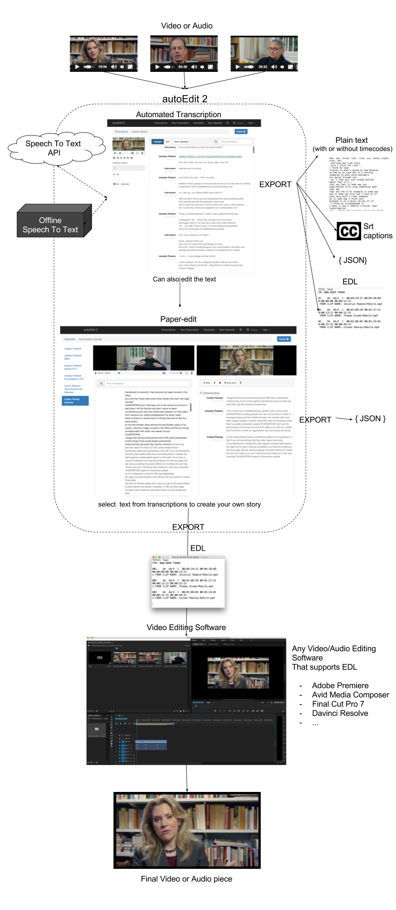

---
# You don't need to edit this file, it's empty on purpose.
# Edit theme's home layout instead if you wanna make some changes
# See: https://jekyllrb.com/docs/themes/#overriding-theme-defaults
test: "yoo what's up?"
title: "autoEdit"
layout: default
---

### User Manual  
See the [user manual for](https://pietropassarelli.gitbooks.io/autoedit2-user-manual/content) for a walkthrough on how to use it.

---

### How can I get started?

1. [Setup Speech to Text service of choice](https://pietropassarelli.gitbooks.io/autoedit2-user-manual/content/setup-stt-apis.html){:target="_blank"} 
	-  IBM Watson STT Service.
	- Speechmatics
	-  Gentle offline Open source STT
	-  Pocketsphinx offline Open source STT
	- Rev, Human transcriptions
<!-- find bluemix tutorial on IBM site -->
2. [Download the last stable release of the Mac Os X app ]({{site.download}}){:target="_blank"}    
<!--  -->
3. [Check out the user manual for a more detailed tutorial](https://pietropassarelli.gitbooks.io/autoedit2-user-manual/content){:target="_blank"}   

---

### How does it work?

---

### Support 
Sign up to the [mailing list](http://eepurl.com/cMzwSX), follow on [twitter](http://twitter.com/autoEdit2) and/or [facebook](https://www.facebook.com/autoEdit.io/) to keep up to date with the latest releases. Say hi at <a href="mailto:pietro@autoEdit.io?Subject=Hello" target="_top">pietro@autoEdit.io</a>, always curious to hear what autoEdit is helping you with.

### Open source 
This is an [open source project]({{site.github}}){:target="_blank"} 
in it's current version it was originally created as part of a [Knight-Mozilla fellowship](https://opennews.org/what/fellowships/){:target="_blank"} by [Pietro Passarelli](http://pietropassarelli.com){:target="_blank"} with the [Vox Media product team](http://product.voxmedia.com){:target="_blank"}. You can [contribute]({{site.github}}){:target="_blank"} and/or <a href="mailto:{{site.email}}?Subject=autoEdit%202%20question">propose ideas</a> you have for this project.

[autoEdit.io](http://www.autoEdit.io) is free and open source. Free as in free speech as well as in free beer. [Help support the autoEdit project to keep it that way](https://donorbox.org/c9762eef-0e08-468e-90cb-2d00643697f8?recurring=true). Support will go towards fixing bugs, adding features, provide support for users etc.